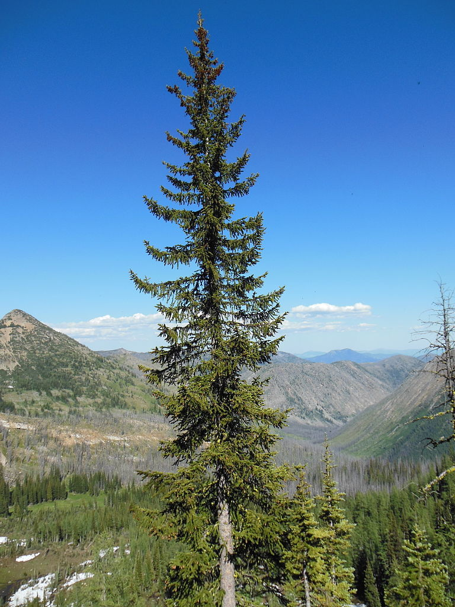
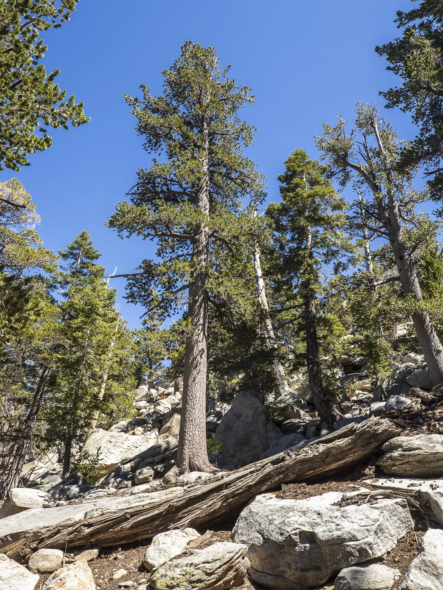
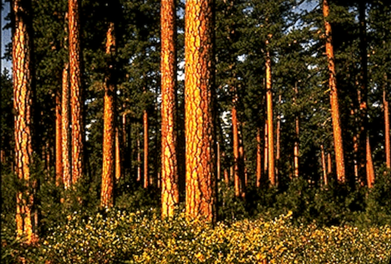
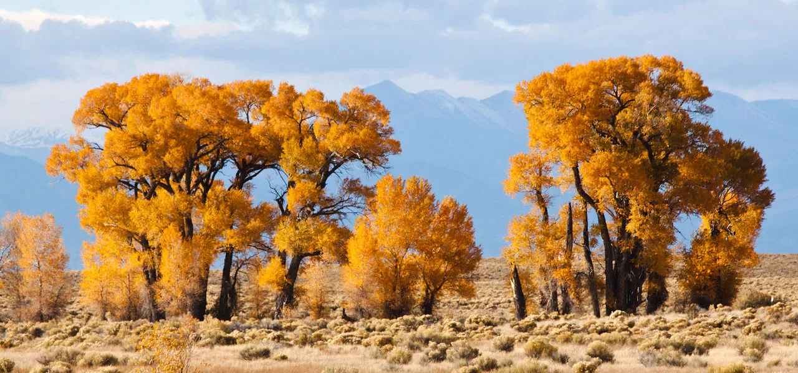
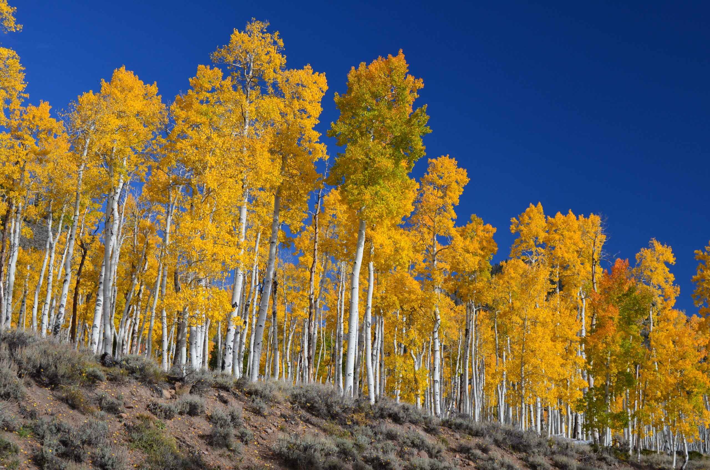
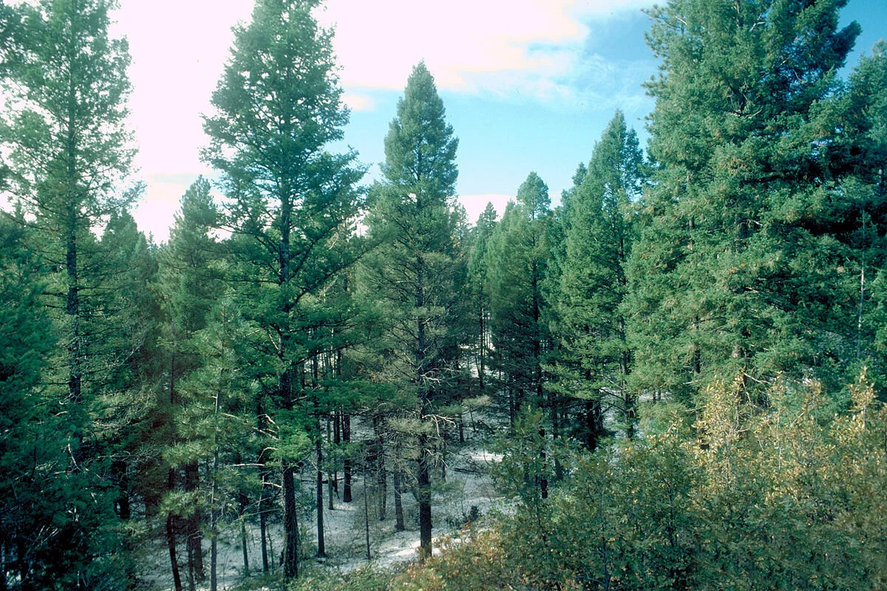
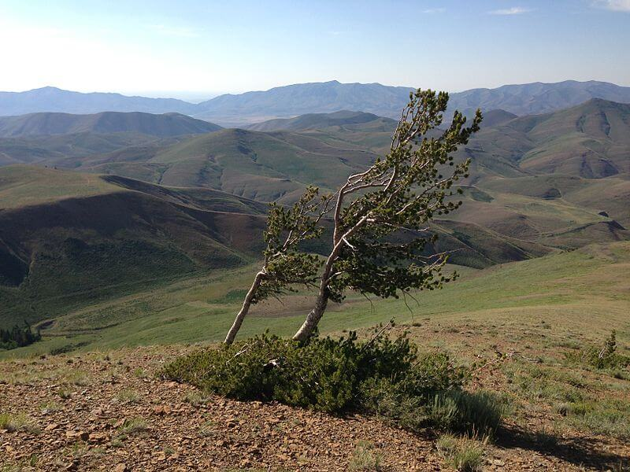

# Ecology Through Data: Forest Cover Type Analysis

An exploratory data analysis of 581,012 forest land parcels in Colorado's Roosevelt National Forest, investigating how elevation, soil, sunlight, and terrain shape the distribution of seven tree species across four wilderness areas.

**Course:** DS 5010 · Introduction to Programming for Data Science · Spring 2026  
**University:** Northeastern University · Khoury College of Computer Sciences, Silicon Valley  
**Author:** Debbie Viona  
**Dataset:** [Covertype](https://archive.ics.uci.edu/dataset/31/covertype) — UCI Machine Learning Repository (581,012 records, 54 features)

---

## About the Project

This project treats the dataset as an **ecological field study**, asking not just *what* patterns exist, but *why* they exist. Every question is interpreted through the lens of forest ecology — explaining species distributions using concepts like elevational zonation, microclimate effects of slope aspect, soil-moisture relationships, and ecological niche theory.

---
## The Seven Cover Types

| # | Species | Elevation | Habitat | Key Trait |
|---|---------|-----------|---------|-----------|
| 1 | **Spruce/Fir** | 2,700–3,300m | Subalpine | Shade-tolerant, dense canopy, thin bark vulnerable to fire |
| 2 | **Lodgepole Pine** | 2,400–3,200m | Subalpine | Generalist colonizer, serotinous cones opened by fire heat |
| 3 | **Ponderosa Pine** | 1,800–2,500m | Montane | Fire-adapted, thick orange bark, prefers warm south-facing slopes |
| 4 | **Cottonwood/Willow** | 1,800–2,400m | Riparian | Obligate riparian, needs shallow groundwater, rarest cover type |
| 5 | **Aspen** | 2,200–3,000m | Montane–Subalpine | Clonal reproduction via root suckers, pioneer after disturbance |
| 6 | **Douglas-fir** | 2,000–2,700m | Montane | Prefers cool north-facing slopes, mid-shade tolerance |
| 7 | **Krummholz** | 3,200m+ | Alpine treeline | Not a species but a growth form — wind-stunted trees at treeline |

## The Seven Cover Types

| | | |
|:---:|:---:|:---:|
|  |  |  |
| **1. Spruce/Fir** | **2. Lodgepole Pine** | **3. Ponderosa Pine** |
| Dense subalpine canopy | Straight, uniform post-fire stands | Thick orange bark, open understory |
| | | |
|  |  |  |
| **4. Cottonwood/Willow** | **5. Aspen** | **6. Douglas-fir** |
| Riparian, follows streams | White bark, clonal groves | Cool north-facing slopes |
| | | |
|  | | |
| **7. Krummholz** | | |
| Wind-stunted trees at treeline | | |

## Highlights

- **9 engineered features** including elevation zones, solar exposure index, topographic moisture index, compass/thermal classification, fire risk tiers, hillshade asymmetry, hydrology ratio, and climatic/geological zones from soil taxonomy
- **Simpson's Diversity Index** computed per wilderness area and per climatic zone to measure biodiversity
- **Ecological niche width analysis** quantifying which tree species are habitat generalists vs. specialists
- **Climatic zone feature engineering** from USFS soil taxonomy codes — a mapping referenced in the UCI documentation but never implemented in existing analyses
- **ANOVA with Bonferroni-corrected post-hoc testing** on elevation across all seven cover types (21 pairwise comparisons)
- **Outlier detection** identifying ecologically "wrong" trees and investigating their microhabitat characteristics
- **Polar rose diagrams** of slope aspect preferences by species
- **Radar chart fingerprints** comparing the ecological identity of four wilderness areas with Euclidean distance similarity

---

## Project Structure

```
ds5010-final-project-DV/
├── covertype_analysis.ipynb   # Main notebook — 25 questions with code, visualizations, and analysis
├── covtype.data.gz            # Compressed dataset
├── README.md                  # Project documentation
└── presentation/              # Video presentation slides and exported figures
```

---

## The 25 Questions

### Ecological Toolkit (Q1–Q5)
Custom functions that transform raw measurements into ecologically meaningful features.

| Q | Question | Feature Engineered |
|---|----------|--------------------|
| 1 | How are cover types distributed across elevation zones? | `elevation_zone` |
| 2 | Which cover types are shade-tolerant vs. sun-demanding? | `solar_exposure` |
| 3 | How does topographic moisture vary across cover types? | `tmi` (Topographic Moisture Index) |
| 4 | Do species prefer warm slopes vs. cool slopes? | `compass`, `thermal_class` |
| 5 | Which species are most exposed to wildfire ignition points? | `fire_risk` |

### Understanding Forest Structure (Q6–Q15)
Pandas and NumPy analysis exploring species distributions, soil associations, and environmental correlations.

| Q | Question | Key Technique |
|---|----------|---------------|
| 6 | How imbalanced is the dataset, and which area is most diverse? | Simpson's Diversity Index |
| 7 | Do elevation profiles match the known Rocky Mountain gradient? | `groupby` + `agg`, range visualization |
| 8 | What is the ecological composition of each wilderness area? | `pd.crosstab`, normalized heatmap |
| 9 | Which soil types are exclusively associated with specific species? | Soil-species affinity matrix |
| 10 | What are the strongest correlations among continuous features? | Pearson correlation matrix |
| 11 | What cover types survive in extreme terrain? | Boolean filtering, distribution comparison |
| 12 | Does distance from roads reveal human influence patterns? | Sampled boxplot, mean markers |
| 13 | Which species experience the most asymmetric daily lighting? | `hillshade_asymmetry` feature |
| 14 | How does water access geometry differ across species? | `hydro_ratio`, violin + scatter |
| 15 | Are rare soil types associated with rare cover types? | Log-scale frequency, shift analysis |

### Seeing the Forest (Q16–Q20)
Visualization-focused questions using Matplotlib and Seaborn.

| Q | Question | Chart Type |
|---|----------|-----------|
| 16 | How do elevation distributions separate the seven species? | Overlapping KDE with zone lines |
| 17 | How do wilderness areas compare when ordered by elevation? | Dual-ordered heatmap with SDI |
| 18 | Do species show distinct compass direction preferences? | Polar rose diagrams |
| 19 | How do cover types separate in elevation-slope space? | Sampled scatter with 7 species |
| 20 | How does the daily solar pattern differ across cover types? | Solar profile heatmap (3 time points) |

### Ecological Niche Analysis Arc (Q21–Q25)
A connected five-question sequence building toward a synthesis.

| Q | Question | Method |
|---|----------|--------|
| 21 | Does elevation statistically separate all cover types? | ANOVA + Bonferroni pairwise t-tests |
| 22 | Which species are generalists vs. specialists? | Niche width scoring (normalized σ) |
| 23 | Can we extract hidden info from soil taxonomy codes? | Climatic + geological zone engineering |
| 24 | Are there trees growing in ecologically "wrong" locations? | Z-score outlier detection + investigation |
| 25 | What is the ecological fingerprint of each wilderness area? | Radar chart + Euclidean distance |

---

## Key Findings

1. **Elevation is the dominant driver** of species distribution, creating a clear gradient from Ponderosa Pine (~2,100m) to Krummholz (>3,200m) — but pairwise tests reveal species pairs that share elevation ranges and must be separated by other factors

2. **Microclimate matters as much as macroclimate** — the Topographic Moisture Index, hillshade asymmetry, and thermal slope classification show that two sites at the same elevation can support entirely different species based on aspect and slope

3. **Species range from strict specialists to broad generalists** — Krummholz occupies the narrowest environmental niche while Lodgepole Pine tolerates the widest range of conditions, consistent with its role as an aggressive post-fire colonizer

4. **The soil taxonomy encodes hidden ecological information** — mapping 40 binary columns to climatic and geological zones extracts decades of USFS field survey work that every other analysis overlooks

5. **Fire and Ponderosa Pine have co-evolved** — its proximity to fire ignition points reflects adaptation, not vulnerability, with thick bark and self-pruning habits shaped by millennia of frequent, low-intensity fire

6. **The four wilderness areas are ecologically distinct** — Cache la Poudre and Neota represent ecological opposites while Rawah and Comanche Peak share the highest biodiversity as mid-elevation areas spanning multiple vegetation zones

---

## Tools & Libraries

Python · pandas · NumPy · Matplotlib · Seaborn · SciPy

---

## How to Run

```bash
git clone https://github.com/dviona/ds5010-final-project-dv.git
cd ds5010-final-project-dv
pip install pandas numpy matplotlib seaborn scipy
jupyter notebook covertype_analysis.ipynb
```

Run all cells in order — Cell 0 (imports & config) must execute before any other cell.

---

## Dataset Citation

Blackard, J. (1998). Covertype [Dataset]. UCI Machine Learning Repository. https://doi.org/10.24432/C50K5N

---

## Author

**Debbie Viona** — MS Data Science (Align), Northeastern University · Khoury College of Computer Sciences, Silicon Valley  